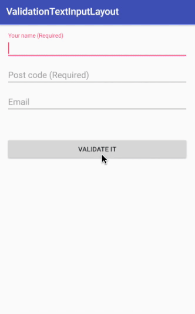

Creating text input layout with validation
===========

[](https://developer.apple.com/iphone/index.action)
[](https://developer.apple.com/swift)
[](http://mit-license.org)

# Overview
This is a sample program that creates an text input layout with validation.



## How to use?

```java
<ValidationTextInputLayout
    app:required="true"
    app:validation_type="email"
    app:error_text="Email value is invalidated"
    >
    <EditText
        android:hint="Email (Required)"
        />
</ValidationTextInputLayout>
```

ValidationTextInputLayout extends TextInputLayout and adds custom attributes (required, validation_type, error_text).
If specified validation type does not pass, the error text is displayed.

## Author

**R. Ayakix**

- Past works: [Product list](http://ayakix.com/) / [Waaaaay!](http://waaaaay.com/)
- Blogs: [English](https://medium.com/@Ayakix) / [Japanese](http://blog.ayakix.com/)
- Contact: [Twitter](https://twitter.com/ayakix)
